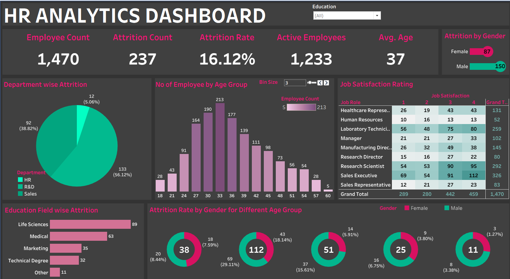
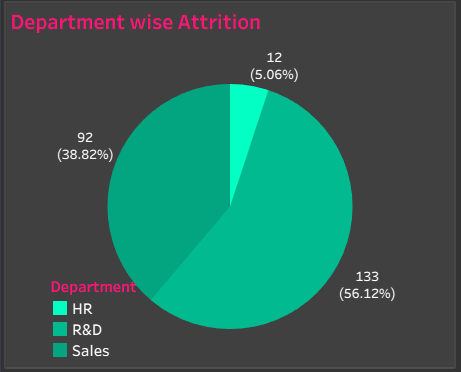
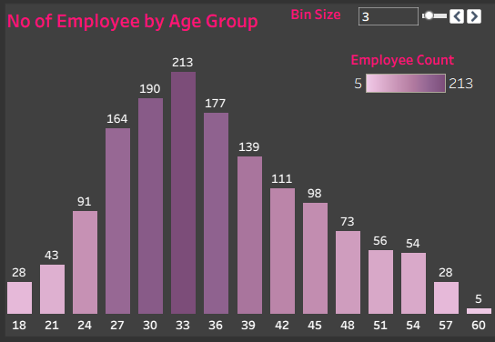
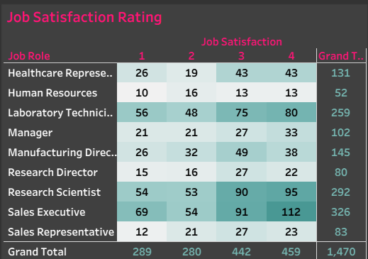
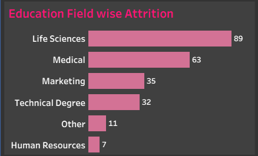
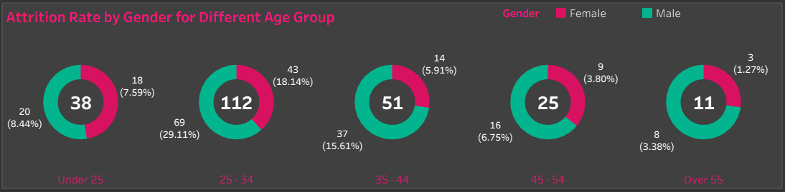
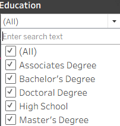

# HR Analytics Tableau Dashboard

### Live Dashboard
🔗 View Interactive Dashboard:
[Tableau Public HR Analytics Dashboard](https://public.tableau.com/app/profile/saumya.singhal3356/viz/HRANALYTICSDASHBOARD_17818704236230/HRANALYTICSDASHBOARD?publish=yes)
## Dashboard Overview
An interactive Tableau dashboard designed to analyze employee attrition, demographics, job satisfaction, and workforce trends. The dashboard combines KPI cards, filters, and visualizations to transform HR data into actionable business insights and support data-driven decision-making.

### 🗝️Key Features
- Employee Count KPI
- Attrition Rate Analysis
- Gender Distribution
- Age Group Analysis
- Department-wise Attrition
- Education Field Analysis
- Job Satisfaction Insights

### 🛠️Tools Used
- Tableau
- Data Visualization
- Dashboard Design
- Data Analysis

### KPI Section

This section highlights key HR metrics such as Employee Count, Attrition Count, Attrition Rate, Active Employees, and Average Age, providing a quick overview of workforce trends and employee retention.

### Attrition by Gender

This visualization analyzes employee attrition across gender groups, providing insights into workforce retention patterns. It helps identify differences in attrition rates between male and female employees, supporting HR teams in developing targeted retention strategies and promoting workplace diversity.

### Department wise Attrition

This chart highlights employee attrition across departments, helping identify turnover patterns and areas that may require targeted retention strategies.

### Number of Employee by Age Group

This chart illustrates the distribution of employees across various age groups, helping organizations understand workforce demographics and identify key employee segments.

### Job Satisfaction Rating

This visualization analyzes employee satisfaction levels across different job roles, providing insights into workforce engagement and employee experience. It helps identify areas where satisfaction is high or low, enabling organizations to make informed decisions to improve employee retention and workplace satisfaction.

### Education Field wise Attrition

This chart highlights attrition trends across different education fields, helping identify workforce retention patterns and supporting data-driven HR decision-making.

### Attrition Rate by Gender for Different Age Group

This chart highlights attrition trends across different age groups and genders, helping identify workforce segments with higher turnover and supporting data-driven HR decision-making.

### Dashboard Header & Education Filter
    

The dashboard header presents key navigation elements, while the interactive Education filter enables users to explore HR metrics and attrition trends across different educational backgrounds.

## Conclusion
The HR Analytics Dashboard transforms raw workforce data into meaningful insights through interactive visualizations and KPI metrics. By analyzing employee attrition, demographics, job satisfaction, and workforce distribution, the dashboard helps identify key trends and supports data-driven decision-making. This project demonstrates practical skills in Tableau, data visualization, dashboard design, and business analytics.
