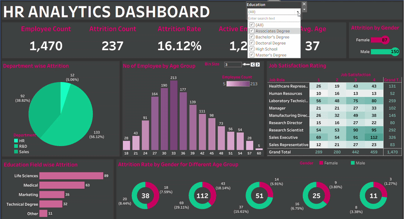
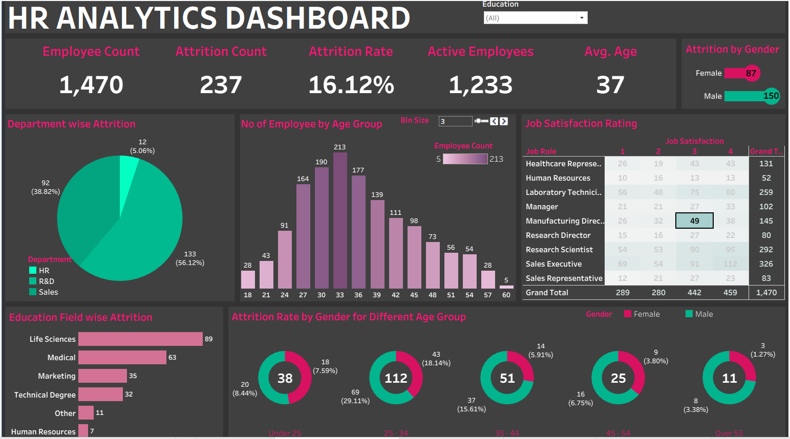
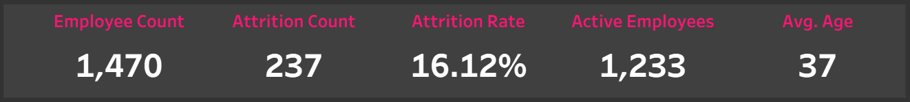
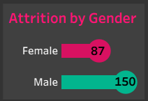

# HR Analytics Tableau Dashboard

### Live Dashboard
🔗 View Interactive Dashboard:
[Tableau Public HR Analytics Dashboard](https://public.tableau.com/app/profile/saumya.singhal3356/viz/HRANALYTICSDASHBOARD_17818704236230/HRANALYTICSDASHBOARD?publish=yes)
## Dashboard Overview
An interactive Tableau dashboard designed to analyze employee attrition, demographics, job satisfaction, and workforce trends. The dashboard combines KPI cards, filters, and visualizations to transform HR data into actionable business insights and support data-driven decision-making.

### 🗝️Key Features
- Employee Count KPI
- Attrition Rate Analysis
- Gender Distribution
- Age Group Analysis
- Department-wise Attrition
- Education Field Analysis
- Job Satisfaction Insights

### 🛠️Tools Used
- Tableau
- Data Visualization
- Dashboard Design
- Data Analysis

### KPI Section

This section highlights key HR metrics such as Employee Count, Attrition Count, Attrition Rate, Active Employees, and Average Age, providing a quick overview of workforce trends and employee retention.

### Attrition by Gender

This visualization analyzes employee attrition across gender groups, providing insights into workforce retention patterns. It helps identify differences in attrition rates between male and female employees, supporting HR teams in developing targeted retention strategies and promoting workplace diversity.
